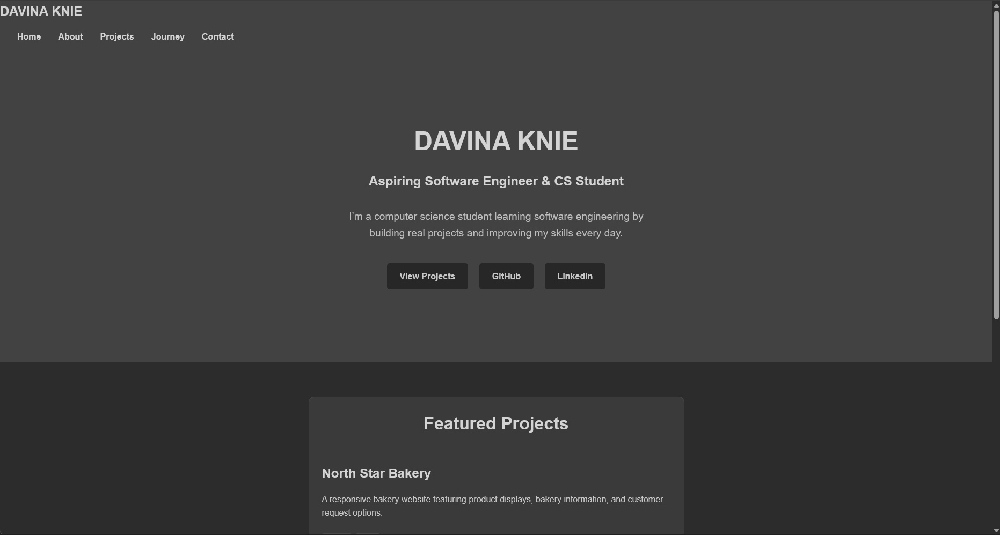

# Davina Knie — Developer Portfolio

My personal developer portfolio showcasing my projects, skills, and progress as I build my foundation in software engineering.

🌐 **Live Website:** https://davinaknie.com

## Preview

## About the Project

I built this portfolio to document my development journey and create a central place to showcase the projects I build as my skills grow.

The portfolio began with HTML and has continued to evolve as I've learned CSS and JavaScript. I use it not only to showcase finished work, but also to practice responsive design, project organization, Git, GitHub, and maintaining a deployed website.

## Features

- Multi-page responsive website
- Project showcase
- About and education sections
- Development journey and learning timeline
- Contact page
- Responsive navigation
- Custom domain
- GitHub Pages deployment

## Built With

- HTML5
- CSS3
- JavaScript
- Git
- GitHub
- GitHub Pages

## What I'm Learning

Building and maintaining this portfolio has helped me practice:

- Semantic HTML
- Responsive CSS
- JavaScript fundamentals
- DOM manipulation
- Organizing multi-page websites
- Git branches and commits
- GitHub workflows
- Deploying and maintaining a live website

## Future Improvements

As my skills grow, I plan to continue improving the portfolio by:

- Adding new software projects
- Expanding JavaScript functionality
- Improving accessibility
- Improving performance
- Documenting my development progress
- Adding projects that use additional technologies

## Author

**Davina Knie**

Computer Science student focused on software engineering and building practical development experience.

🌐 [davinaknie.com](https://davinaknie.com)

💻 [github.com/davinatech](https://github.com/davinatech)

